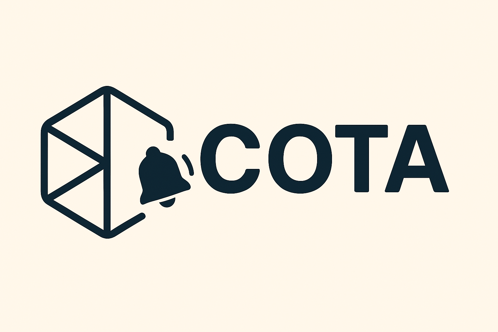
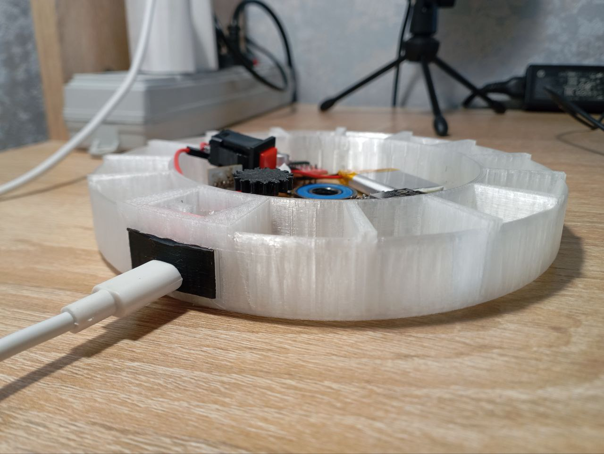

<div align="center">
<p>

</p>


<p>
</p>
</div>

## 💊 Умная Таблетница «СОТА»

**Инженерно-программный проект**, направленный на создание универсальной системы контроля приёма различных лекарственных препаратов. Подразумевающий разработку умной таблетницы, сочетающей в себе простоту и эффективность использования. 

---
### 📷 Демонстрация

| Устройство                                                                          | Интерфейс (...) |
|-------------------------------------------------------------------------------------|-----------------|
| <p align="center"></p> | ###             |

---
### 📊 Что за «СОТА»?

Это **умная таблетница**, которая:
- 📱 Легко привязывается к специальному мобильному приложени.
- ✒️ Быстро и легко настраивается, учитывая при этом запросы пользователя.
- 🌐 Может подключаться к сети для более эффективной работы.
- 🔔 Напоминает о приёме лекарственных препаратов по расписанию.
- 💡 Подсвечивает и открывает нужный отсек в соответствии с конфигурацией.
- 📊 Хранит журнал приёмов и ведёт статистику.

---
### 🎯 Общие цели и принципы 
| Цель                           | Принцип                                                                                             |
|--------------------------------|-----------------------------------------------------------------------------------------------------|
| ⏰ Своевременный приём лекарств | Гибкая и удобная в настройке система, которая привязывает выдачу препарата к определённому времени. |
| 🔐 Исключение ошибок           | Выдача препаратов производится автоматически без вмешательства человека.                            |
| 📲 Удалённый доступ            | Возможность просмотра данных и настройки через приложение.                                          |
| 🛠 Компактность конструкции    | Умную таблетницу можно спокойно переносить в небольших сумках, рюкзаках и т.д.                      |
## 📦 Структура репозитория

```text
SoTa/
├── hardware/           ← Аппаратная часть: схемы, 3D-модели, прошивка
│   ├── schematics/     ─ Электросхемы, подключения
│   ├── 3d_models/      ─ Корпус таблетницы (STL/M3D/A3D)
│   └── firmware/       ─ Код для микроконтроллера (ESP32)

├── software/           ← Программная часть: веб-интерфейс, сервер, логика
│   ├── backend/        ─ Серверное API, алгоритмы на Python
│   ├── frontend/       ─ Интерфейс на React
│   └── desktop_app/    ─ автономное приложение

├── docs/               ← Документация, презентация, инструкции
├── media/              ← Фото, мокапы, скриншоты, демонстрации, лого и прочее
└── README.md           ← Вы здесь :)
```

