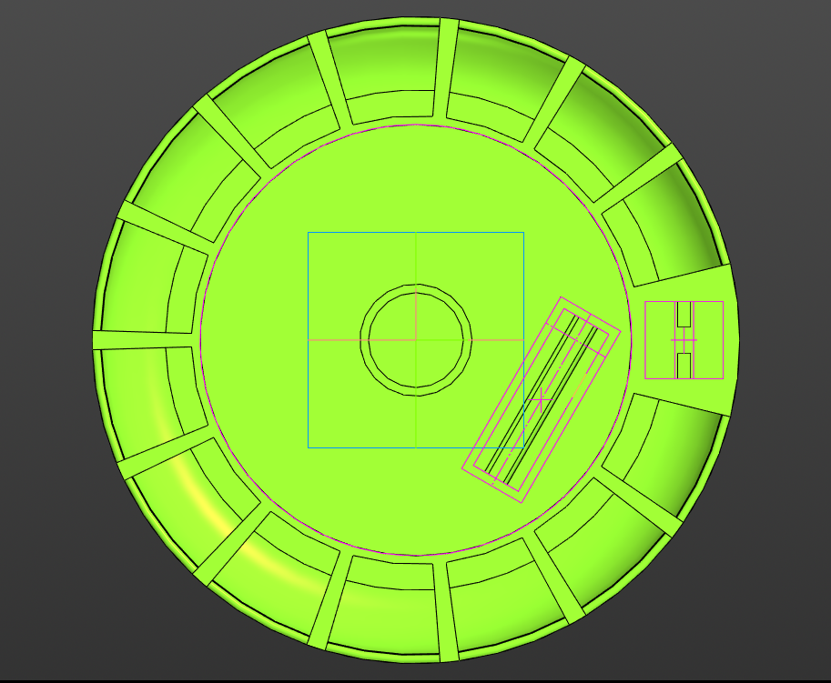
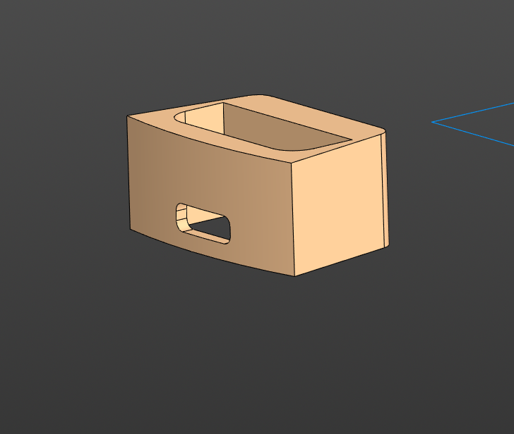

# 💡 Проектирование

Основной особенностью умной таблетницы **«СОТА»** является её небольшой размер, позволяющий носить её с собой в течение дня или держать рядом на небольшом столике. Именно поэтому при проектировании устройства особое внимание уделялось **балансу** между **вместимостью и компактностью**. 

---
## 🔧 Модель корпуса

Основной конструкционной идеей является механизм **револьверного типа**. Крашка таблетницы может поворачиваться на **заданную ячейку**, совершая выдачу **препаратов**, находящихся в этой ячейке.

| Ячейки                                                                                                                                     | Крышка                                                                                                                                                     | Зарядный бокс                                                                                                                                                               |
|--------------------------------------------------------------------------------------------------------------------------------------------|------------------------------------------------------------------------------------------------------------------------------------------------------------|-----------------------------------------------------------------------------------------------------------------------------------------------------------------------------|
| 

                                                  | 

                                                                      | 

                                                                      |
| Всего корпус таблетницы содержит **15 ячеек**, одна изкоторых является заглушкой. Размещение препаратов в ячейках может быть произвольным. | Крышка предназначена для выдачи препаратов в соответствии с **расписанием**, настроенным ранее в приложении, так, крышка проворачивается на нужную ячейку. | Зарядный бокс выполняет скорее **демонстративную функцию**. За ним находится зарядная плата с разъёмом **Type-C**, позволяющим программировать и заряжать умную таблетницу. |
