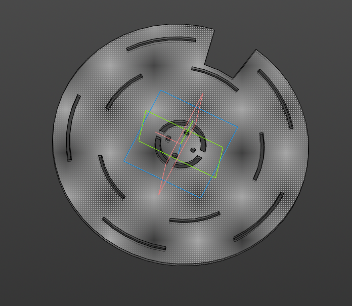
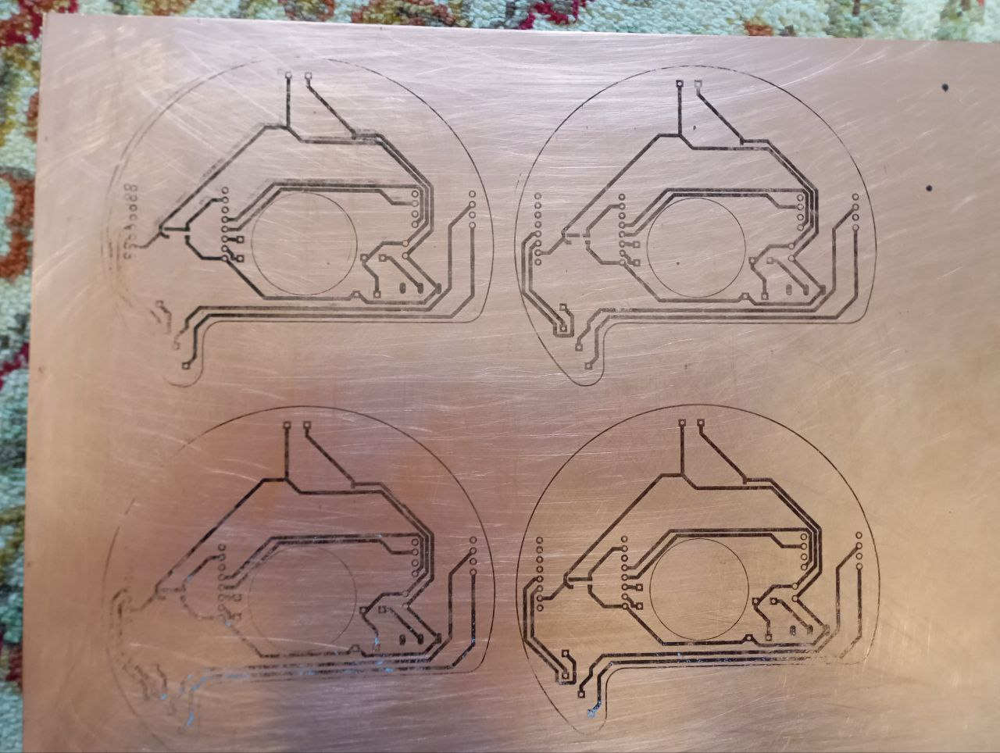
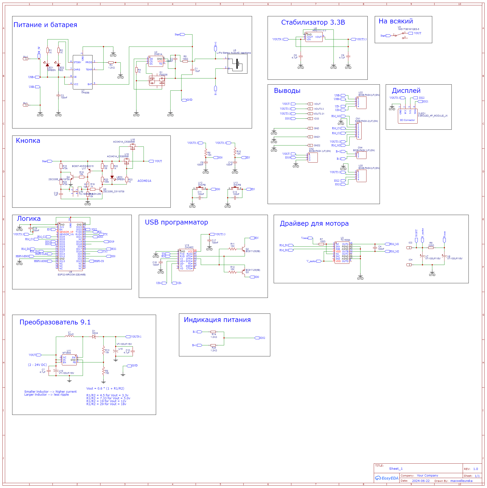

# 💡 Проектирование

Основной особенностью умной таблетницы **«СОТА»** является её небольшой размер, позволяющий носить её с собой в течение дня или держать рядом на небольшом столике. Именно поэтому при проектировании устройства особое внимание уделялось **балансу** между **вместимостью и компактностью**. 

---
## 🔧 Модель корпуса

Основной конструкционной идеей является механизм **револьверного типа**. Крашка таблетницы может поворачиваться на **заданную ячейку**, совершая выдачу **препаратов**, находящихся в этой ячейке.

| Ячейки                                                                                                                                     | Крышка                                                                                                                                                     | Зарядный бокс                                                                                                                                                               |
|--------------------------------------------------------------------------------------------------------------------------------------------|------------------------------------------------------------------------------------------------------------------------------------------------------------|-----------------------------------------------------------------------------------------------------------------------------------------------------------------------------|
| <p align="center"></p>                                                  | <p align="center"></p>                                                                      | <p align="center"></p>                                                                      |
| Всего корпус таблетницы содержит **15 ячеек**, одна изкоторых является заглушкой. Размещение препаратов в ячейках может быть произвольным. | Крышка предназначена для выдачи препаратов в соответствии с **расписанием**, настроенным ранее в приложении, так, крышка проворачивается на нужную ячейку. | Зарядный бокс выполняет скорее **демонстративную функцию**. За ним находится зарядная плата с разъёмом **Type-C**, позволяющим программировать и заряжать умную таблетницу. |
---
## ⚡ Электроника

Решение делать **печатную плату** было принято не сразу. Сначала рассматривались варианты с производством платы по технологии **ЛУТ-а**, но она к сожалению не обладала достаточной точностью. Переносить дорожки с бумаги на **текстолит** было досточно проблематичным, даже при условии толщины дорожки в **1 мм**.
<p align="center"></p>

<p align="center"><i>Собственнл лист текстолита с несколькими платами. Да, из-за особенностей технологии некоторые дорожки перенеслись плохо и их пришлось дорисовывать.</i></p>

Была создана печатная плата. Она уже позволяла разместить больше компонет. Также ширина дорожек питания сократилась до **0.7 мм**, а ширина других до **0.3 мм**.

| Печатная плата 2D                                                                                   | Принципиальная схема                                                                                 |
|-----------------------------------------------------------------------------------------------------|------------------------------------------------------------------------------------------------------|
| <p align="center"></p> | <p align="center"></p> |

## ▶️ Электроника в общем

```text
          +----------------------+
          |  Аккумулятор Li-Pol  |               #Питание поступает от аккумулятора 3.7 V и преобразуется в 9 V.
          +----------------------+               #Далее 9 V через стабилизатор понижаются до 3.3 V и проходят дальше.
                    |                            #От стабилизатора питаются ESP32, мотор с энкодером и LED-лента.
                  3.7 V                          #Управление всеми компонентами осуществляется с микроконтроллера.
                    ↓
          +----------------------+
          |  Преобразователь 9 V |
          +----------------------+
                    |                         
                   9 V                        +----------------------+
                    ↓                    ―― → |  LED лента           | ← ―
          +----------------------+      |     +----------------------+    |
          |                      |      |     +----------------------+    |
          |  Стабилизатор 3.3 V  | ―― 3.3 V → |  Мотор с энкодером   |    |
          |                      |            +----------------------+    |
          +----------------------+                              ↑         |
                    |                                           |         |
                   3.3 V                                        | ―― ―― ――
                    ↓                                           |
          +----------------------+                              |
          |  ESP32-WROOM         | ―― управляющее воздействие ――
          +----------------------+
```
